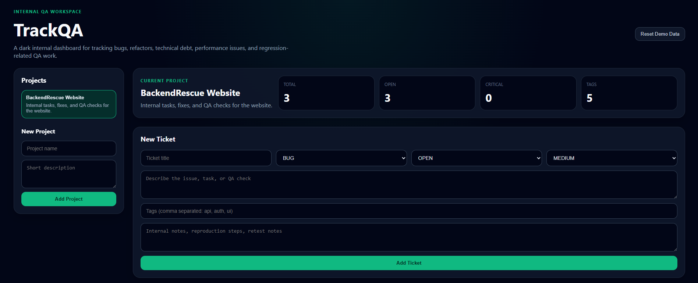

# TrackQA Task Manager

TrackQA is a lightweight task and QA workflow management tool designed to help developers organize debugging, refactors, and development tasks.

The system allows teams to track issues through different stages of development and maintain visibility across projects.

---

## Screenshot



---

## Features

- Create and manage development tasks
- Track workflow stages (New, In Progress, Testing, Completed)
- Organize debugging and QA work
- Tag and categorize issues
- Visual dashboard for tracking progress

---

## Tech Stack

- Next.js
- React
- Tailwind CSS
- JavaScript

---

## Purpose

TrackQA was built as a developer workflow tool to manage:

- debugging tasks
- technical debt
- QA processes
- development progress

It is designed to keep development work organized and transparent across projects.

---

## Getting Started

Clone the repository:

```bash
git clone https://github.com/curtis-fawcett/TrackQA.git